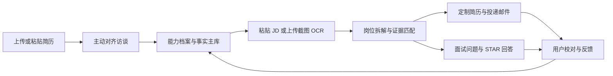

# 律转 Agent

> **把法律人的经历，翻译成真正的职业价值。**

一个面向法律人及专业背景转型者的个人求职 Agent。它不会只帮你润色简历，而是先理解你的经历，主动发现可迁移能力，再把这些能力匹配到目标岗位，生成可以直接使用的简历、面试回答和求职行动方案。

<p align="center">
  <a href="https://lvzhuan-agent.vercel.app">在线体验</a> ·
  <a href="#产品流程">产品流程</a> ·
  <a href="#agent-特性">Agent 特性</a> ·
  <a href="#本地运行">本地运行</a>
</p>


## 为什么做律转

很多法律人并不是没有能力，而是别人看见他们的经历以后，不知道这些经历和目标岗位有什么关系。

“审合同、写法律意见、做合规、参与项目”这些原始经历背后，可能包含风险识别、流程设计、项目推进、知识工程和跨部门协作能力，但它们通常没有被翻译成招聘方听得懂的语言。

律转要解决的不是“把简历写得更漂亮”，而是帮助用户回答：

- 我真正拥有的能力是什么？
- 这些能力可以迁移到哪些岗位？
- 我怎样用真实证据证明自己能解决问题？

## 产品理念

律转借鉴“把才华变成价值”的方法：不从“我会什么”开始，而从“我帮助谁解决什么问题”开始；不把经历写成自传，而是把每段经历变成可验证的证据；不让 AI 替用户编造身份，而是让 AI 负责整理、推理和执行，把判断权留给用户。

> **不是能力不够，是不知道怎么讲。**

## 法律人的职业价值翻译层

律转不是把通用简历模板套在法律人身上，而是在底层维护一套法律能力本体。系统先从原始经历中识别法律能力，再判断它与目标岗位的关系：

```text
原始事实 → 法律能力标签 → 可迁移能力 → JD 要求 → 可核验的求职表达
```

当前能力标签包括：法律研究与信息检索、合同审核与风险识别、合规管理与制度建设、案件分析与复杂问题拆解、跨部门沟通与利益协调、专业表达与决策材料、法律知识结构化与数字化、多项目交付与客户服务。

每条转译都会区分：

- **直接匹配（direct）**：原经历直接做过目标工作；
- **可迁移能力（transferable）**：岗位名称不同，但底层能力相同；
- **邻近能力（adjacent）**：有相关基础，但不能写成已经具备。

这套规则让“审合同”可以被解释为风险识别、质量控制和决策支持，让“法律研究”可以被解释为结构化分析、信息筛选和知识整理，但不会把协助经历夸大为主导经历，也不会创造用户没有做过的项目。

## 产品流程



### 1. 主动访谈：挖出用户自己没有意识到的优势

Agent 会继续追问“具体负责了什么、遇到什么问题、做了哪些行动、产生了什么结果”，把“我只是审合同”还原成真实的场景、动作和能力。

访谈还会提出初步职业假设，例如 Legaltech 产品经理、法务运营、合规运营、法律知识工程师或企业服务产品经理，再通过问题验证，而不是直接替用户下结论。

### 2. 能力档案：一次梳理，持续复用

访谈结果沉淀为长期能力档案，包括：

- 完整工作、实习、项目经历；
- 教育背景和开始/结束时间；
- 证书、考试和其他硬背景；
- 核心优势和可迁移能力；
- 待补充能力和关键词库；
- 每次判断对应的事实证据。

原始经历是主档案。换一个目标岗位，只重新选择和组织相关经历，不重新编造一个人。

### 3. JD 分析：逐条匹配，而不是只给一个分数

用户可以粘贴 JD，也可以上传 PNG、JPG、WebP 截图，OCR 识别后回填并允许手动校对。

系统会拆解岗位的职责、必备条件、加分条件和隐含信号，并把要求分为：

| 匹配类型 | 含义 |
| --- | --- |
| 直接匹配 | 用户已经做过，有明确事实证据 |
| 可迁移能力 | 工作名称不同，但底层能力相同 |
| 邻近能力 | 有相关基础，还需要补足 |
| 能力缺口 | 当前没有足够事实支持 |

每条判断尽量附带来源经历、匹配理由、补足行动和可验证证据。

### 4. 定制简历：从经历主库中选择最相关的内容

同一份能力档案，可以针对不同岗位生成不同版本的简历。当前提供四种模板：

- **Classic ATS**：单栏、稳定，适合海投和机器筛选；
- **Pillar 信息卡**：蓝色信息卡风格，适合产品和 Legaltech；
- **Elegant 衬线**：编辑感和咨询感更强；
- **Swiss 栅格**：高对比、现代，适合创意和互联网岗位。

支持网页预览、Word 导出和 PDF 导出。PDF 与网页共用同一套 A4 模板，保留中文、照片、颜色和布局。

### 5. 面试准备：从事实出发练习表达

根据同一份 JD 和能力档案，生成：

- 预测面试问题；
- 每道题考察的能力；
- 对应事实证据；
- STAR 回答框架；
- 30–60 秒简要回答；
- 面试官可能的追问。

用户可以继续说“更口语化”“更突出产品能力”“强调跨部门协作”，Agent 会在事实边界内重新生成。

## Agent 特性

### 主动性

不是等待用户问问题，而是主动发现信息缺口，追问到具体场景、行动和结果。

### 记忆性

能力档案贯穿 JD 分析、简历生成、投递邮件和面试准备，用户梳理一次，之后可以针对多个岗位复用。

### 事实约束

每次改写都要能够回答“这句话来自哪段经历”。没有证据时，标记为待补充、可迁移推断或需要用户确认。

### 推理与翻译

把经历翻译成岗位语言：

- 合同审查 → 风险识别、规则理解、流程设计；
- 多部门沟通 → 利益相关方管理、项目推进；
- 制度建设 → 产品规则设计、知识库建设；
- 法律研究 → 信息检索、复杂问题拆解；
- 大量合同处理 → 流程优化和运营效率。

### 工具调用与执行

Agent 会根据任务调用简历解析、OCR、JD 分析、能力匹配、简历生成、Word/PDF 导出、邮件草稿和面试准备等工具，完成一条连续的任务链。

## 近期迭代

### 已完成

- 建立经历主库和事实证据机制，减少硬背景遗漏；
- 加强教育、工作和实习经历的时间线处理；
- 增加 JD 图片 OCR 模式；
- 增加直接匹配、可迁移能力、邻近能力和能力缺口分类；
- 增加职业方向和能力地图展示；
- 增加四种简历模板；
- 增加面试准备、AI 简要回答和继续追问；
- 修复 PDF 中文缺失、照片丢失和网页版式不一致问题；
- 增加离线演示入口，降低路演现场对网络的依赖。

### 下一步

- 增加用户对每条事实证据的确认和版本管理；
- 支持多个岗位并行比较；
- 增加项目作品集和求职行动计划；
- 根据真实面试反馈持续更新能力档案；
- 丰富 Legaltech、AI 产品和法务数字化岗位知识库。

## 路演 Demo 建议

建议现场只展示一条完整闭环：

1. 上传一份法律人的原始简历；
2. 展示 Agent 提出的职业方向假设；
3. 回答一个主动追问，生成能力档案；
4. 上传一张目标 JD 截图并完成 OCR；
5. 展示一条可迁移能力和对应事实证据；
6. 切换简历模板并生成 A4 PDF；
7. 进入面试准备，生成一道问题和一版 30 秒回答。

现场重点不是展示“功能很多”，而是让评委看到同一份用户事实如何被多个任务连续复用。

## 技术栈

- **Frontend**：Next.js、React、TypeScript、Tailwind CSS
- **AI**：OpenAI 兼容接口，可配置模型和视觉模型
- **文档处理**：简历解析、结构化输出校验、HTML/CSS A4 渲染、Word/PDF 导出
- **OCR**：视觉模型识别招聘软件截图
- **存储**：浏览器本地存储；可选 Upstash Redis 跨设备档案分享
- **演示稳定性**：内置脱敏离线演示数据

## 本地运行

```bash
npm install
cp .env.example .env.local
npm run dev
```

打开 <http://localhost:3000>。

### AI 配置

```env
AI_API_KEY=your_api_key
AI_BASE_URL=https://api.deepseek.com
AI_MODEL=deepseek-chat
AI_VISION_MODEL=gpt-4o-mini
```

不配置 AI 时，仍可使用页面上的离线演示模式。

### 验证

```bash
npm run build
npm audit
```

## 隐私说明

- 简历和 JD 默认保存在当前浏览器，用于当前求职流程；
- JD 图片只用于 OCR，不会持久保存；
- 跨设备档案分享需要用户主动配置 Redis；
- 路演离线数据为脱敏示例。

## 更新日志

### 2026-08-14 · Pitch & PDF polish

- 新增路演方法论底稿；
- 完善 README、产品定位和 Agent 工作流说明；
- PDF 导出改为复用网页 HTML 模板；
- 修复中文字体、照片和 A4 单页布局问题；
- 增加面试简要回答和继续追问体验。

### 2026-08-13 · JD & Resume workflow

- 增加 JD 图片 OCR；
- 增加四种简历模板；
- 增加能力匹配的证据链和可迁移能力分类；
- 增加离线演示入口和面试准备模块。

## 愿景

每个人都有一座能力矿山。律转 Agent 希望帮助用户把经历挖出来、解释清楚、匹配到真实岗位，并最终变成一份简历、一场面试，甚至一次新的职业选择。

> **把才华变成钱的第一步，不是变得更厉害，而是让别人知道你的才华能解决什么问题。**
